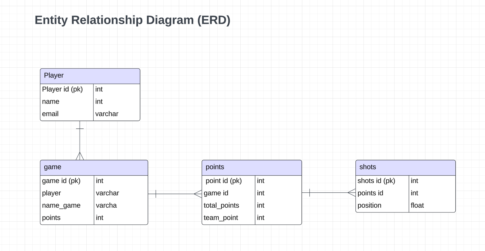
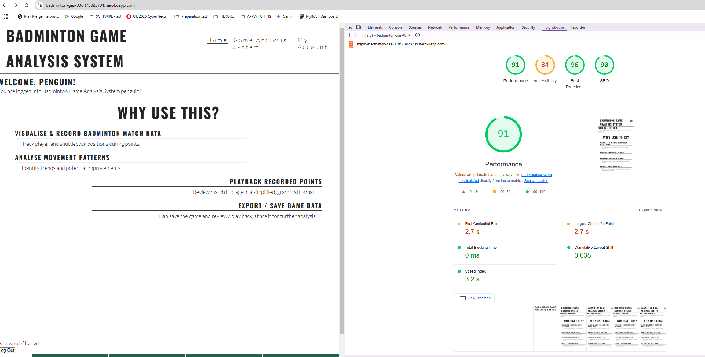
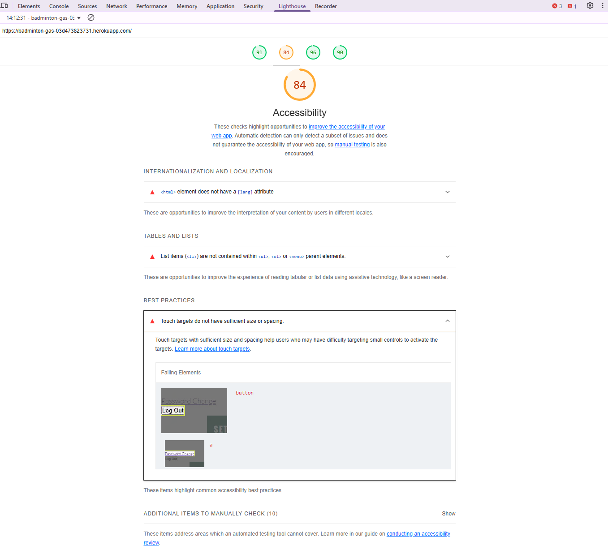
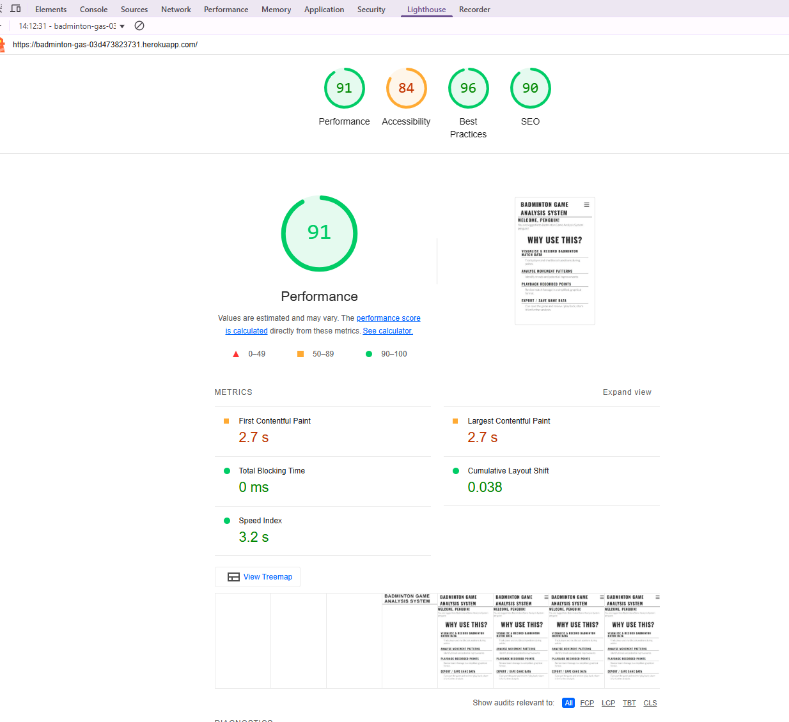
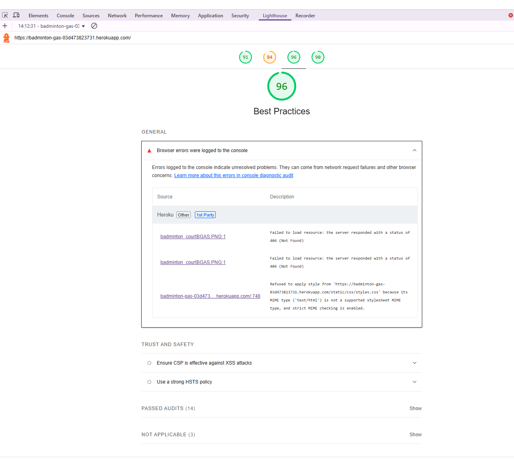
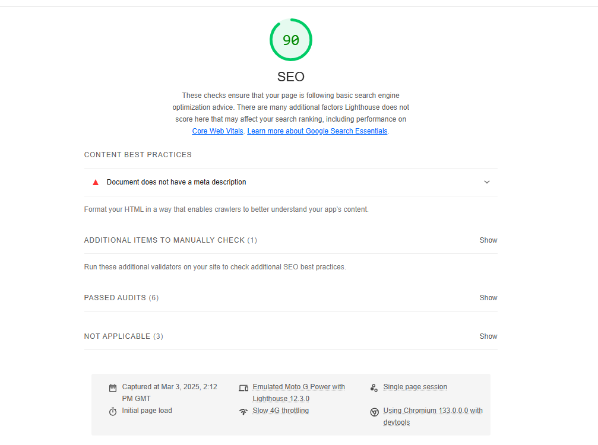
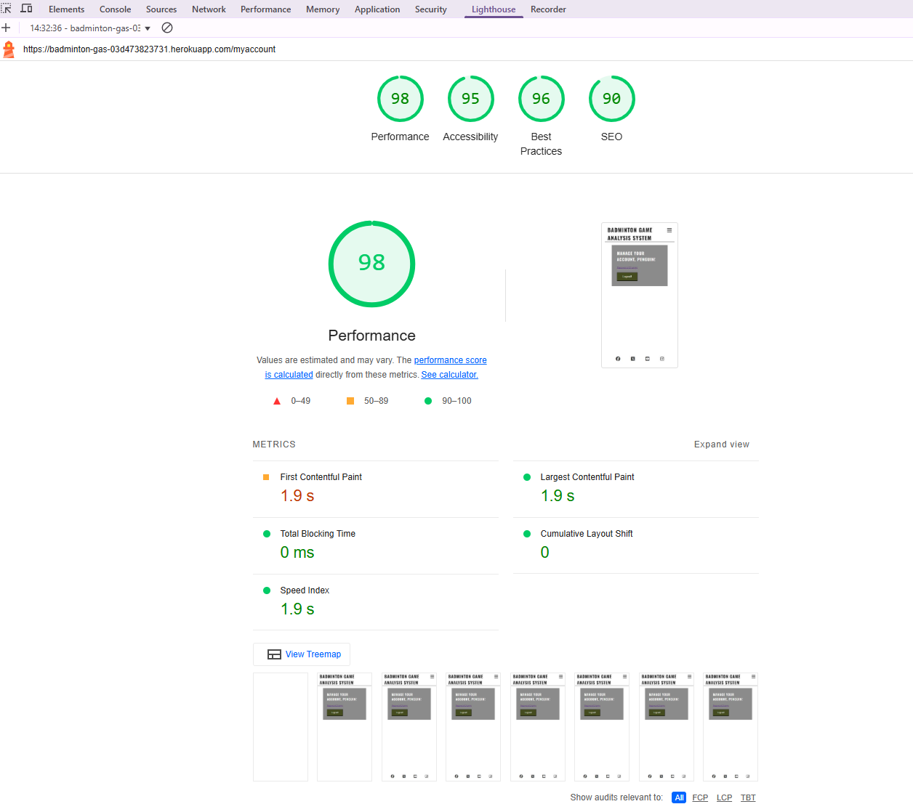
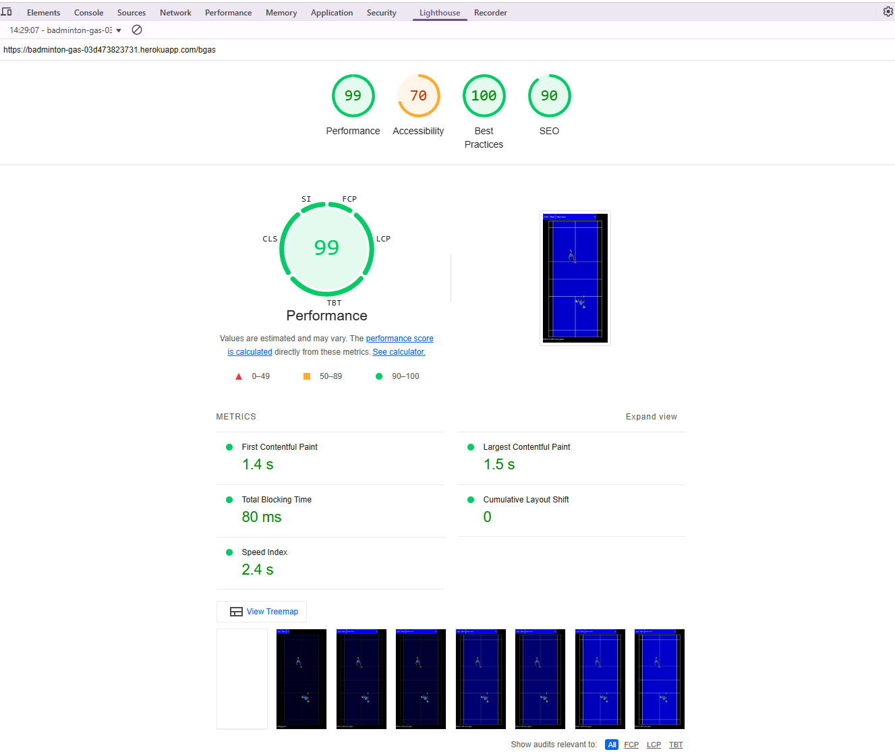

# Project3_BadmintonGameAnalysis
Check out the deployed Badminton Game (PASTE LINK)

## Table of Contents
### 1. [Introduction](#Introduction)
### 2. [Desired Outcome](#desired-outcome)
### 3. [Proposed Features](#proposed-features)
### 4. [Wireframe](#wireframe)
### 5. [Design and Features](#design-and-features)
### 7. [Testing](#testing)
### 8. [Deployment](#deployment)
### 9. [Future Improvements](#future-improvemnts)
### 10.[Credits](#credits)

# Introduction 

## Game Analysis System (GAS) Application
The Game Analysis System (GAS) Application is an extension of my Project 2, where I created an interactive badminton court. Project 3 builds upon this by introducing a system that analyses and evaluates a game, collecting and processing relevant game data to provide insights into performance, tactics, and outcomes. This will enable users to improve their gameplay and strategy.

Due to time constraints, I am developing a Minimal Viable Product (MVP) that will:
- Record the number of shots per rally
- Playback recorded games
- Specify the outcome of the game (winner or loser)
Track rally sequences and replay them

https://badminton-gas-03d473823731.herokuapp.com/ 

### Future Enhancements
Future iterations will include:
- Categorizing shots (e.g., smash, drop, clears, nets)
- Specifying types of outcomes (e.g., unforced errors, forced errors)
- Advanced statistical analysis and visualization of player performance

## Data Storage
An Entity Relationship Diagram (ERD) has been created to visually represent the database structure, forming the foundation for data management.

## Challenges & Learning Curve
###### [Back to the top](#table-of-contents)
As I am in the process of upskilling, the challenges I will face is as follow:
- Backend learning curve: Frameworks - Python / Django I may need extra time to understand the basics
- Debugging & testing: Integrating frontend and backend, handling database queries and testing on Heroku could take longer than expected if issues arise
- Unfamiliar tasks: authentication and database is new to me, therefore trying to achieve this in a short space of time can be difficult.
    
## Tech Stack:
- **Frontend:** 
    HTML: Structure for UI, login/registration pages, game input forms, and replay interface
    CSS & Bootstrap: Styling and responsiveness
    JavaScript: Interactivity, game replay animations, form validation, and data handling
- **Backend:**  Python & Django - Application logic and database management
- **Database:** PostgreSQL - Database management and storage and retrieval.
- **Deployment:** HerokuL: Hosting and deployment

# Desired Outcome
###### [Back to the top](#table-of-contents)

## Core components of MVC
The project follows the Model-View-Controller (MVC) framework:

- Model (Data Layer): Stores user login details, game information, and replay sequences

- View (Frontend/UI): User-friendly interfaces for login, game input, and replay functionality

- Controller (Backend/Logic): Handles authentication, game data storage, and replay functionality

This project intends to satisfy the following Learning Objectives:

- LO1: Plan and design a full-stack application using an Agile methodology
- LO2: Implement a data model, features, and business logic
- LO3: Apply authentication and authorization features
- LO4: Create manual and/or automated tests
- LO5: Use GitHub for version control and documentation
- LO6: Deploy the application on a cloud platform.
- LO7: Utilise object-oriented programming concepts

###### [Back to the top](#table-of-contents)
# Proposed Features
I have used EPIC to define this project's high-level goal and or objectives on this project 3. 

## User Stories
### As a badminton enthusiast:
- "I want an interactive platform to improve my gameplay so I can enhance my skills and knowledge."

### Frontend Interaction
- "I want to see a responsive badminton court to visualise different positions and strategies."

### User Progress Tracking
- "I want to save my progress so I can continue where I left off."

### Backend Integration
- "I want to create an account and log in securely to save my analysis."
- "I want the app to save my games and shots, so I can replay and analyse them."

### Deployment
- "I want the app to be accessible online and on multiple devices."

# WireFrame 
###### [Back to the top](#table-of-contents)

Wireframe for Game Analysis System page only, taking into condition the responsiveness.

# Design and Features
###### [Back to the top](#table-of-contents)
Given the aggresive deadline, I will focus on the Minimal Viable Product (MPV) approach.
For an MVP, I will ensure core functionality works without worrying about advanced features or intricate design. Here's the breakdown of essential features, that project 3 will focus on:

### MVP Features
### Frontend Features:
- User authentication (login/registration)
- Input forms for game names, points, and shots
- Visual replay of recorded games

### Backend Features:
- Secure storage of user and game data
- Replay functionality for game sequences

### Deployment:
- Heroku (or an alternative cloud platform)

**Testing & Validation**
- Manual Testing: Core features- registration, court interactivity, progress tracking
- Automated Testing: Basic unit tests for key functionalities
- Browser Compatibility: Tested on Chrome, Firefox, Edge, Vivaldi, Brave, and Tor Browser
- Accessibility & Performance: Lighthouse Audit: Measures accessibility, SEO, and best practices. W3C Validators: Ensures HTML, CSS, and JavaScript meet coding standards

**Key Priorities**
- Ensure backend systems (like authentication and data storage) are working, but don't worry about advanced features or perfect security for now.

---------------------------------------------------------------------------------------------------------

# Testing
###### [Back to the top](#table-of-contents)
To ensure all features work as intended. The following test was performed

## Browser Friendly
The site has been tested for the following browsers: Chrome, Firefox, Edge.
Checked use this [Browserling.com](https://www.browserling.com/browse/win10/chrome127/https://badminton-gas-03d473823731.herokuapp.com/)

## Accessible - Lighthouse test 
Used this to test the quality of the website. Providing a comprehensive audit of the website's performances, accessibility, SEO (Search Engine Optimisation), best practices capabilities.

Summary of areas where improvements are provided, this would be areas for improvements at a later date. Documents can be found as PDF.
<a href="staticfiles/images/Lighthouse_Summary_homepg.pdf">

# Deployment
###### [Back to the top](#table-of-contents)
The Game Analysis System (GAS) Application is deployed on Heroku.

## Deployment Steps:
- Ensured all dependencies are listed in requirements.txt.
- Use Procfile to specify the app's entry point.
- Configure environment variables in Heroku.
- Use PostgreSQL as the production database.

Deploy using Heroku Git:
- git add .
- git commit -m "Deploy to Heroku"
- git push heroku main

Verify deployment by accessing the Heroku live link.
Live Application: Game Analysis System on Heroku ([https://badminton-gas-03d473823731.herokuapp.com/](Link to Project 3 deployed))

# Future Improvements
Here are future feature ideas to further improvements on this project:
- Enhanced shot categorisation (smash, drop, clears, etc.)
- Performance analytics (player statistics), dashboard - view at a glance
- AI-driven game strategy suggestions

Due to limited time and little support from WAES and Code Institute materials for the backend, I had to self-learn many of the steps. As a result, I created a responsive website to showcase the intended design of the application. I have used GitHub to deploy the website, providing a live link for public access. I wrote the code using Visual Studio Code, linking it to GitHub for deployment. I have now deployed this to Heroku following Code Institute's instructions. I am still in the process of self-learning backend languages and deployment processes, which I have found to be the most challenging aspect. Correct as of 28 Feb 2025.

# Credits
###### [Back to the top](#table-of-contents)
The following links and websites were used to asisst with my development of the code and content of the website.
Code Institute bootcamp materials, ChatGPT, W3 Schools was used as part of research to learn the concept of for loop, if/else statements, switch, functions.
* [W3 Schools](https://www.w3schools.com/)
* Javascript 
* SVG Tutorials 
https://www.w3schools.com/graphics/svg_intro.asp
https://www.youtube.com/watch?v=WzxBfkUtM1Y
https://webdesign.tutsplus.com/svg-viewport-and-viewbox-for-beginners--cms-30844t

* Code Reviewer: M.P (Friend who has not given permission to share his fullname)

* Lucid Chart - creation
* Followed the following tutorial to create django login and logout - https://learndjango.com/tutorials/django-login-and-logout-tutorial#log-out-button
* Stackover flow -django csrf token : CSRF token missing or incorrect https://stackoverflow.com/questions/67175389/django-csrf-token-csrf-token-missing-or-incorrect 
###### [Back to the top](#table-of-contents)

